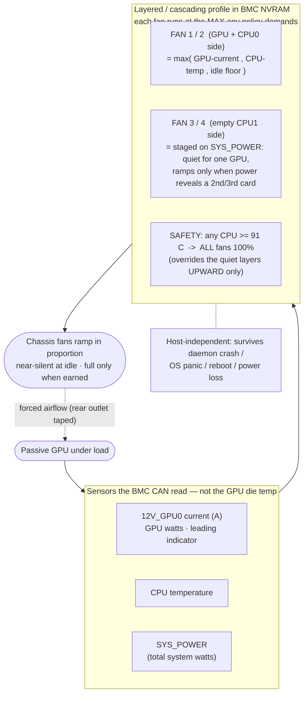

# Gigabyte R282 / MZ92-FS0 BMC Fan Control for a Passive GPU

**Open-source fan control for Gigabyte MZ92-FS0 servers (R282-Z9x / R182-Z9x)
whose AMI MegaRAC BMC won't cool a passive datacenter GPU.** Near-silent at idle,
ramping in proportion to GPU load, and safe even if the host software dies.

Drop one passive enterprise GPU — an AMD **Radeon Pro V620**, **Instinct MI210**,
an NVIDIA **Tesla A100 / A40 / T4**, an Intel **Data Center GPU Flex** — into a
Gigabyte **R282-Z93** (or any **MZ92-FS0** board) and the chassis fans either sit
idle while the card cooks, or you crank them to a deafening flat 100 %. The AMI
**MegaRAC** BMC (on an **AST2500**) only ramps its fans for GPUs on the vendor's
supported list, and your card isn't on it.

This repo makes the **BMC itself** cool the GPU properly — by reverse-engineering
its own web fan-control API.

📖 **Full write-up (same story, longer):** [Why is my Gigabyte server so damn loud
with only one enterprise GPU in it?](https://aimfirstvn.com/blog/why-is-my-gigabyte-server-so-loud-one-gpu/)
· also in [`docs/blog.md`](docs/blog.md).

## Which hardware

The **MZ92-FS0** board (dual AMD EPYC, AMI MegaRAC BMC on an AST2500) sits under a
whole family — all with the same BMC and the same fan-control gap:

- **2U:** Gigabyte R282-Z90 / Z91 / Z92 / Z93 / Z94 / Z96
- **1U:** Gigabyte R182-Z90 / Z91 / Z92 / Z93
- plus other Gigabyte EPYC servers with the same MegaRAC BMC.

## The problem

A passive datacenter GPU has no onboard fan — it lives entirely on chassis air.
But the BMC's `GPU*_PROC` temperature sensors read **"No Reading"** for an
unsupported card, so its automatic fan curve — which only watches CPU / inlet /
board temperatures that all stay cool — never ramps for the GPU. At the stock
~3,000 RPM idle our V620 hit **99 °C** and clock-throttled. Every host-side lever
is a dead end:

- **`ipmitool` raw fan control** → `Invalid command (0xc1)`.
- **Redfish** *reads* the fan profile but **rejects writes** (`405` / `400`).
- **`amdgpu-fan` / PWM daemons** → a passive card exposes **no `fan`/`pwm` sysfs**.
- **Power capping** → `power1_cap` is **locked at 250 W** (min == max).

The one thing that changes fan speed is the BMC's web UI — so we drive what it
drives.

## The fix: reprogram the BMC's own fan controller

The web UI changes fan profiles over a proprietary **`/api/`** interface. Log in
for a **CSRF token + session cookie**, `POST` a custom profile, read it back to
verify, then set it **Active** — and log out cleanly (the BMC caps concurrent
sessions and idle sessions expire to `401`). We don't replace the BMC's fan
controller; we point it at the right sensors.

## Why layering it is safe

The BMC drives each fan at the **maximum duty any active policy demands** — a
`max()` across every policy on that fan. That one fact lets you **cascade** policies
without them fighting:

- **GPU-current curve** on the GPU-side fans — the BMC can't read die temp, but it
  reads **`12V_GPU0` current (A)**, a fast leading proxy for GPU watts (A × 12 V ≈ W).
- **CPU-temperature curves** — the ordinary safety, left running underneath.
- **`SYS_POWER` staging** on the far fans — silent for one GPU, ramping only when
  total wattage reveals a **second / third card**.
- **A hard 91 °C all-fan critical** — any CPU over 91 °C → all fans 100 %.
- **A quiet idle floor** under all of it.

Because the controller always obeys the *loudest* policy, the aggressive "stay
quiet" layer can never suppress safety — it can only ever be **overridden upward**
by it. Quiet lowers the floor; safety raises the ceiling; the BMC picks the higher.

## Sensors the host could never wire to fans

Doing this *in the BMC* is the point: it owns both the sensor bus and the fan
headers, so it can turn signals no host tool can act on into fan speed —
`12V_GPU0` **current** (leading proxy for GPU watts), `SYS_POWER` (reveals extra
GPUs), and **CPU temps**. No Linux fan daemon can drive a fan off "the GPU is
pulling 18 amps."

## Safe even if the daemon dies

The **entire profile lives in the BMC's NVRAM** and runs on the BMC's own
processor, independent of the host. Host daemon crashes, OS panics, box reboots or
loses power and comes back — the BMC keeps cooling as configured. Pair it with
**power-restore = always on** and the machine cools itself autonomously. The
optional host daemon is **extra insurance only**, for the one thing the BMC can't
read (GPU **junction** temperature); kill it and the server is still safe.

## How it works



## Fan-tuning realities (measured, don't guess)

- **The fans can't stop** — a 0 % duty test still hard-floors all four at
  **~3,300 RPM** (hardware minimum).
- **RPM is not linear with PWM** — measured **RPM ≈ 2,900 + 131 × duty%**, so a
  3 % change is nowhere near 500 RPM.
- **Quiet idle** = shift the over-aggressive inlet-air floor up (it was ramping to
  30 % at a 28 °C room) **and** set the GPU-side **FAN1/2 idle floor to 12 %
  (~4,500 RPM)** — flooring everything let CPU0 drift up ~10 °C. FAN3/4 stay at the
  ~3,300 RPM floor. Load ramps and the 91 °C safety are untouched.

## A $0 airflow mod

On a half-populated board the **single CPU0 shares its side with the GPU** and the
**CPU1 socket is empty**, so airflow leaks straight out the rear over the empty
side. We **taped off the hind (rear) middle outlet section** to force more
front-to-back airflow across the GPU/CPU zone that actually needs it — a crude,
free tweak that measurably helps a passively-cooled card. Do it before you reach
for higher (louder) fan duty.

## Validated: 12 h at ~650 W

A **12-hour full-GPU soak** at ~650 W, with **PSU1 and PSU2 on separate wall
sockets**: **zero power events**, **ECC 0/0**, **no thermal throttle**
(prompt-processing throughput flat across 10+ h, ≈1,519 tok/s), **GPU junction
57–80 °C**, both PSUs healthy. Full procedure in [`docs/TESTING.md`](docs/TESTING.md).

## Install

Full step-by-step guide: **[`docs/INSTALL.md`](docs/INSTALL.md)**. The short
version (Python 3.8+, `requests`):

```bash
pip install requests
export BMC_HOST=bmc.example.lan BMC_USER=admin BMC_PASS='your-password'

python3 scripts/apply-fan-profile.py backup  stock-profile.json   # back up first
python3 scripts/apply-fan-profile.py apply   my-fan-profile.json  # write (read-back verified)
python3 scripts/apply-fan-profile.py mode    fankit-v3            # activate
python3 scripts/apply-fan-profile.py restore stock-profile.json   # revert anytime
```

Start from a layered example in [`results/`](results) (`fankit-v3.profile.json`)
and adapt the sensor/fan indices to your board using
[`docs/fan-profile.md`](docs/fan-profile.md). Back up first, test on an idle GPU —
you're reprogramming the BMC's fan control.

## What's here

- **[`docs/blog.md`](docs/blog.md)** — the full write-up (same story as this README).
- **[`docs/INSTALL.md`](docs/INSTALL.md)** — short install & usage guide.
- **[`docs/TESTING.md`](docs/TESTING.md)** — idle / ramp / CPU / 12 h soak verification guide.
- **[`docs/fan-profile.md`](docs/fan-profile.md)** — reverse-engineered sensor
  reference, working fan curves, and validated thermals.
- **`scripts/apply-fan-profile.py`** — apply/activate/back-up a fan profile over
  the BMC's `/api/` interface (login → CSRF → `POST`, every write verified).
- **`results/`** — real BMC fan-profile JSON snapshots (including the final layered
  profile). Keep them to restore the stock profile.
- **`scripts/`** — GPU burn-in, thermal-guard, telemetry, and ramp-test tooling
  used to validate the curves.

## Safety

Keep independent hardware backstops regardless of the profile: a GPU clock-cap
guard and the card's own ~99 °C throttle. Test on an idle GPU first; the snapshots
in `results/` let you restore the stock profile.

## Roadmap / Contributing

Help wanted: **rewrite the tool in C/Rust** (drop Docker + Python), **add CI + a
BMC `/api/` mock** (test without hardware), **a fleet API** to push profiles to a
whole rack, **multi-GPU zoning**, and **standard named profiles**
(max-throughput / min-power / quiet). See the roadmap in [`docs/blog.md`](docs/blog.md).

---

*All connection details in the docs and scripts are placeholders — set your own
BMC host and credentials via the environment at runtime. Nothing real is committed.*
