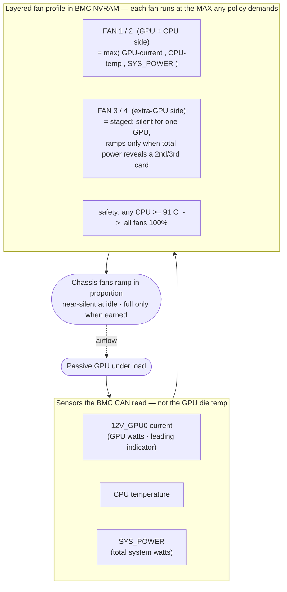

# Gigabyte R282 BMC Fan Control for a Passive GPU

**Open-source fan control for Gigabyte MZ92-FS0 servers (R282 / R182) whose BMC
won't cool a passive datacenter GPU.**

Drop one passive enterprise GPU — an AMD **Radeon Pro V620**, **Instinct MI210**,
an NVIDIA **Tesla A100 / A40 / T4**, an Intel **Data Center GPU Flex** — into a
Gigabyte **R282-Z93** (or any **MZ92-FS0** board) and the chassis fans either sit
idle while the card cooks, or you crank them to a deafening flat 100 %. The AMI
**MegaRAC** BMC only ramps its fans for GPUs on the vendor's supported list, and
your card isn't on it.

This repo shows how to make the **BMC itself** cool the GPU properly — near-silent
at idle, ramping in proportion to GPU load — by reverse-engineering the BMC's own
fan-control API.

📖 **Full write-up:** [Why is my Gigabyte server so damn loud with only one
enterprise GPU in it?](https://aimfirstvn.com/blog/why-is-my-gigabyte-server-so-loud-one-gpu/)

## Which hardware

The **MZ92-FS0** board (dual AMD EPYC, AMI MegaRAC BMC on an AST2500) sits under a
whole family — all with the same BMC and the same fan-control gap:

- **2U:** Gigabyte R282-Z90 / Z91 / Z92 / Z93 / Z94 / Z96
- **1U:** Gigabyte R182-Z90 / Z91 / Z92 / Z93
- plus other Gigabyte EPYC servers with the same MegaRAC BMC.

## How it works



The standard Redfish API *reads* the fan profile but refuses to *write* it (`405`
/ `400`). The BMC web UI changes profiles over a proprietary `/api/` interface:
log in for a CSRF token + session cookie, then `POST` the fan profile back.

The profile layers policies — the BMC drives each fan at the **max** any policy
demands:

- **GPU current** (`12V_GPU0` amps — a leading proxy for GPU watts, since the BMC
  can't read the die temperature)
- **CPU temperature** and **total system power**
- a staged second fan pair that stays silent for one GPU and ramps only when total
  power reveals a second / third card
- a hard **91 °C** all-fan safety, and a near-silent idle.

## Install

Full step-by-step guide: **[`docs/INSTALL.md`](docs/INSTALL.md)**. The short
version (Python 3.8+, `requests`):

```bash
pip install requests
export BMC_HOST=bmc.example.lan BMC_USER=admin BMC_PASS='your-password'

python3 scripts/apply-fan-profile.py backup  stock-profile.json   # back up first
python3 scripts/apply-fan-profile.py apply   my-fan-profile.json  # write (read-back verified)
python3 scripts/apply-fan-profile.py mode    fankit-v3            # activate
python3 scripts/apply-fan-profile.py restore stock-profile.json   # revert anytime
```

Start from a layered example in [`results/`](results) and adapt the sensor/fan
indices to your board using [`docs/fan-profile.md`](docs/fan-profile.md). Back up
first, test on an idle GPU — you're reprogramming the BMC's fan control.

## What's here

- **[`docs/INSTALL.md`](docs/INSTALL.md)** — installation & usage guide.
- **`scripts/apply-fan-profile.py`** — apply/activate/back-up a fan profile over
  the BMC's `/api/` interface (login → CSRF → `POST`, every write verified).
- **`docs/fan-profile.md`** — the reverse-engineered sensor reference, working fan
  curves, and validated thermals.
- **`docs/blog.md`** — the write-up.
- **`results/`** — real BMC fan-profile JSON snapshots (including the final
  layered profile). Keep them to restore the stock profile.
- **`scripts/`** — GPU burn-in, thermal-guard, telemetry, and ramp-test tooling
  used to validate the curves.

## Safety

Keep independent hardware backstops regardless of the profile: a GPU clock-cap
guard and the card's own ~99 °C throttle. Test on an idle GPU first; the snapshots
in `results/` let you restore the stock profile.

---

*All connection details in the docs and scripts are placeholders — set your own
BMC host and credentials via the environment at runtime. Nothing real is
committed.*
