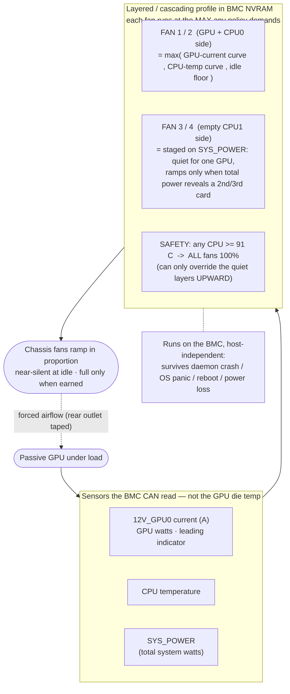

# Why Is My Gigabyte Server So Damn Loud With Only One Enterprise GPU In It?

You drop one enterprise GPU into a Gigabyte **R282-Z93** and suddenly it's either
a jet engine or it's quietly cooking the card. Either way the fans are wrong.

This is the story of how we reverse-engineered a closed **AMI MegaRAC** BMC to
fix **Gigabyte MZ92-FS0 fan control** for good — near-silent at idle, ramping in
proportion to what the GPU is actually doing, and safe even if every piece of
host software dies. Everything here is open source.

## The BMC doesn't understand your GPU

A passive AMD **Radeon Pro V620** has no onboard fan — it needs chassis air, and
so does every passive enterprise GPU: AMD **Radeon Pro V620 / V520**, **Instinct
MI210 / MI250**, NVIDIA **Tesla A100 / A40 / A16 / T4 / L4**, Intel **Data Center
GPU Flex**. The AMI **MegaRAC** BMC only ramps its fans for cards on the vendor's
supported list. Yours probably isn't on it, so the firmware treats the GPU as if
it doesn't exist: it reads the CPUs it can see, keeps them cool, and lets the
card climb straight past 80 °C.

On our board the BMC's `GPU0/1/2_PROC` temperature sensors read **"No Reading"** —
the passive card never reports die temperature over the bus. So the automatic
curve, which only watches CPU / inlet / board temperatures that all stay cool,
never ramps for the GPU. At the stock ~3,000 RPM idle, a sustained workload drove
the V620 to **99 °C** and it clock-throttled from ~2,400 MHz down to 845 MHz.

So you do the only thing the web UI obviously lets you do — crank the fans up by
hand. Now the whole 2U howls at a fixed high speed, all fans, all the time, idle
or flat out. That's the "so damn loud" you're hearing: a dumb, static fan speed
compensating for a BMC that can't see your card.

## It's the motherboard, not just your model

This isn't one odd server — it's the **board**. Gigabyte's **MZ92-FS0** (dual AMD
EPYC, AMI MegaRAC BMC on an **AST2500**) sits under a whole family: the 2U
**R282-Z90 / Z91 / Z92 / Z93 / Z94 / Z96** and the 1U **R182-Z90 / Z91 / Z92 /
Z93**, plus other Gigabyte EPYC servers with the same BMC. Same fan controller,
same supported-GPU list, same silence about your card — and Gigabyte never
open-sourced any of it, which is why the search that sent you here turned up
nothing.

## Everything that does *not* work (so you don't waste a weekend)

We tried the obvious levers first. All of them are dead ends on this firmware:

- **`ipmitool` raw fan control** — the `0x3a` / `0x30` / `0x3c` command families
  all return **Invalid command (`0xc1`)**. There is no CLI lever here.
- **Redfish** — the standard Redfish API *reads* the fan profile fine, but every
  attempt to *write* it comes back **`405` / `400`**. It is read-only by design.
- **`amdgpu-fan` or any PWM daemon** — a passive V620 exposes **no `fan` / `pwm`
  sysfs node**. There is literally no fan on the card to drive.
- **Power capping to reduce heat** — `power1_cap` is **locked at 250 W**
  (min == max), so you can't dump the heat problem by underpowering the card.
- **Vendor fan-control binaries** — closed-source, undocumented, and they don't
  drive a card the firmware refuses to acknowledge anyway.

Every host-side path is a wall. The one thing that *does* change fan speed is the
BMC's own web UI. So the real question became: what is that web UI actually
talking to?

## The fix: make the BMC ramp *with* the GPU

The goal is simple — quiet at idle, only as loud as the GPU actually needs, and
**no permanent flat 100 %**. The insight is that the BMC already has a perfectly
good fan controller; it's just pointed at the wrong sensors. We don't need to
replace it. We need to *reprogram* it.

The web UI changes fan profiles over a proprietary **`/api/`** interface — the
same "BMC web API" the browser panel uses. Watch it work and the handshake is
straightforward:

1. `POST /api/session` with a form login → the BMC returns a **CSRF token** and
   sets a **session cookie**.
2. Every subsequent write carries the cookie **and** an `X-CSRFTOKEN` header.
3. `POST` your custom fan profile back; `GET` it to read-back-verify; then set it
   **Active** by name.
4. `DELETE /api/session` to log out cleanly — the BMC caps concurrent sessions,
   and an idle session expires after ~30 min (any later call then returns `401`).

That's the whole trick. A small tool logs in, POSTs a profile, verifies it, and
logs out. The web panel was never magic — it was just the only client anyone had
written for this API. Now there's another one, and it's open source.

## A profile that stays quiet until the GPU works

Here's the part that makes it *safe* rather than just clever. The BMC drives
each fan at the **maximum duty that any active policy demands** — it takes the
`max()` across every policy attached to that fan. That single design fact is what
lets you **layer** or **cascade** policies without them fighting each other.

So we stack them:

- **A GPU-current curve** on the fans nearest the card. The BMC can't read the
  die temperature, but it *can* read **`12V_GPU0` current in amps**, and current
  is a fast, leading proxy for GPU watts (amps × 12 V ≈ GPU power). This is the
  policy that does the real work for a compute load.
- **CPU-temperature curves** — the ordinary thermal safety the firmware was
  designed around, left running underneath.
- **`SYS_POWER` staging** on the second fan pair — total-box wattage that stays
  silent for a single GPU and only ramps those far fans when the number reveals a
  **second or third card**.
- **A hard 91 °C all-fan critical** — if any CPU crosses 91 °C, everything goes
  to 100 %. No exceptions, no negotiation.
- **A quiet idle floor** underneath all of it.

Because the controller always obeys the *loudest* policy, adding an aggressive
"stay quiet" layer can never suppress the safety layers — it can only ever be
**overridden upward** by them. The quiet layer lowers the floor; the safety
layers raise the ceiling; the BMC always picks the higher of the two. You get a
near-silent idle *and* a controller that still slams the fans to full the instant
a CPU gets hot, with no way for the two goals to deadlock.

## Sensors the host could never tie to fans

This is the quiet superpower of doing it *in the BMC* instead of with a host
daemon. The BMC reads sensors the operating system can see but can **never wire
to a fan**:

| Sensor | What it tells you | Why it matters |
|---|---|---|
| `12V_GPU0` **current (A)** | 0 → ~20 A under GPU load | direct, leading proxy for GPU watts — the best trigger when die temp is unreadable |
| `SYS_POWER` **(W)** | whole-box wattage | reveals a second/third GPU without any per-card sensor |
| `CPU0_TEMP` / `CPU0_DTS` | CPU thermal | the classic safety curve |

No host fan-control tool can turn "the GPU is drawing 18 amps on the 12 V rail"
into "spin FAN1 and FAN2 up." The BMC can, because it owns both the sensor bus
and the fan headers. That's the whole reason we reprogram the BMC instead of
running a clever script on Linux.

## Safe even if the daemon dies

The best property of this approach is what happens when everything goes wrong.

The **entire profile lives in the BMC's NVRAM** and runs on the BMC's own
processor, completely independent of the host. If the host daemon crashes, if the
OS panics, if the box reboots, if it loses power and comes back — the BMC keeps
cooling exactly as configured. Pair it with the BMC's **power-restore = always
on** setting and the machine cools itself autonomously through anything short of
pulling the fans out.

That reframes the host software. We *do* ship an optional host daemon — but only
as **extra insurance** for the one thing the BMC genuinely can't see: the GPU's
**junction temperature**. The daemon can read that over `amdgpu` sysfs and, in
the worst case, cap GPU clocks as a backstop. But it is strictly additive. The
cooling does not depend on it. Kill it and the server is still safe.

## The architecture, in one picture

Sensors feed a layered `max()`-of-policies profile that lives in NVRAM and drives
the fans — and it keeps running whether or not anything on the host is alive.

## The fans lie about RPM (and other tuning realities)

Reprogramming the controller is only half the job; the fans themselves have
quirks you have to measure, not assume:

- **They can't stop.** We proved it with a 0 % duty policy: all four fans still
  **hard-floor at ~3,300 RPM**. There is a hardware minimum you cannot go below.
- **RPM is *not* linear with PWM.** Measured, it's roughly
  **RPM ≈ 2,900 + 131 × duty%** — so a "3 %" change is nowhere near "500 RPM,"
  and duty-vs-RPM intuition from desktop fans will lead you astray.
- **The stock idle floor was over-aggressive on inlet air.** The factory curve
  ramped fans to ~30 % at a 28 °C room temperature; we shifted that policy's
  start point up to 38 °C so it stops shouting at room temperature.
- **But you can't just floor everything.** Sitting all fans at the ~3,300 RPM
  minimum let **CPU0 drift up ~10 °C** (49 → 59–62 °C) because CPU0 shares its
  side of the chassis with the GPU. So we set the **GPU-side FAN1/2 idle floor to
  12 % (~4,500 RPM)** as the quiet-but-safe compromise, and left **FAN3/4 at the
  ~3,300 RPM floor** since the empty CPU1 side has nothing to cool. Load ramps and
  the 91 °C safety are untouched.

The lesson: every one of these numbers came from a measurement on the actual
board. Don't copy duty percentages blindly — copy the *method*.

## A $0 airflow mod that punches above its price

There's a layout gotcha specific to a half-populated board. On our R282-Z93 the
**single CPU0 sits on the same side as riser1 and the V620**, and the **CPU1
socket is empty**. That means FAN1/2 cool the busy GPU+CPU zone while FAN3/4 sit
over a mostly empty half — and a big chunk of chassis airflow was just **leaking
straight out the rear middle outlet over the empty side** instead of doing any
work.

The fix cost nothing: we **taped off the hind (rear) middle outlet section** so
the air can't shortcut out the empty CPU1 side. Now more of the front-to-back
airflow is *forced* across the GPU/CPU zone that actually needs it. It's a crude
tweak — literally tape — but on a passively-cooled card where every CFM across
the heatsink counts, it measurably helps, and it's worth doing before you decide
you need higher fan duty (and more noise) to hit a temperature target.

## Did it actually work? 12 hours at ~650 W

We validated the whole thing with a **12-hour full-GPU soak** at roughly **650 W**
system power, deliberately running **PSU1 and PSU2 on separate wall sockets** to
stress power stability as well as cooling. Results:

- **Zero power events** — continuous uptime, no reboots, no spontaneous power-off.
- **ECC 0/0** — no corrected or uncorrected memory errors.
- **No thermal throttle** — prompt-processing throughput stayed **flat across 10+
  hours** (≈1,519 tok/s), which is the real tell: flat throughput = no clock droop.
- **GPU junction 57–80 °C** the whole run — comfortable margin below throttle.
- **Both PSUs healthy** the entire time.

The full, reproducible test procedure — idle check, GPU load ramp, CPU-temp
behaviour, and the 12-hour soak — is written up in
[`TESTING.md`](TESTING.md).

## Contributing / Roadmap

This works, but it's a proof of concept with rough edges. If you have one of these
boards, here's where help is most welcome:

- **Rewrite the tool in C or Rust.** Today it's Python-in-Docker; a single small
  static binary would drop the Docker + Python dependency entirely and be far
  easier to drop onto a headless host.
- **Add CI and an API mock.** A mock of the BMC `/api/` would let the whole thing
  be **tested without hardware**, so contributors don't need a MegaRAC BMC on the
  bench to send a patch.
- **Build a real fleet API.** A thin service in front of many BMCs so you can push
  profiles to a whole rack of machines instead of one at a time.
- **Multi-GPU control and zoning.** Proper per-card curves and fan zoning for
  boards running two or three passive GPUs, driven off each card's `12V_GPUx`
  current.
- **A set of standard profiles.** Ship named, documented starting points —
  **max-throughput**, **min-power** (fans are a real slice of a node's wattage in
  a data center), and **quiet** — instead of everyone hand-tuning from scratch.

## Takeaway

Your Gigabyte server is loud because the BMC is guessing around a GPU it won't
acknowledge. Stop fighting it with a flat 100 %: under the Redfish veneer is the
real control plane the web UI uses, and once you speak its language you get
proper, quiet, proportional **Gigabyte R282 / MZ92-FS0 fan control** for an
unsupported passive GPU — layered so safety always wins, and living in the BMC's
NVRAM so it survives anything the host throws at it. The tooling is open source.

*All connection details in this write-up are placeholders — set your own BMC host
and credentials at runtime. Nothing real is published.*
